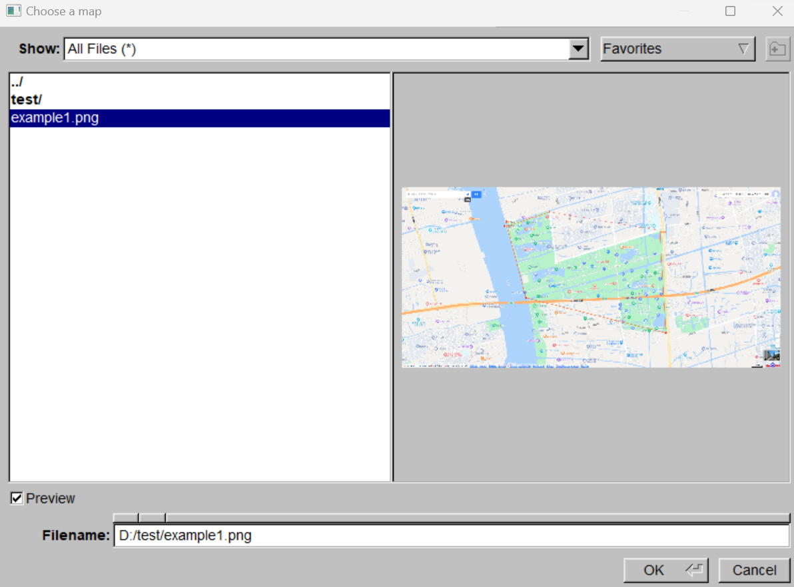
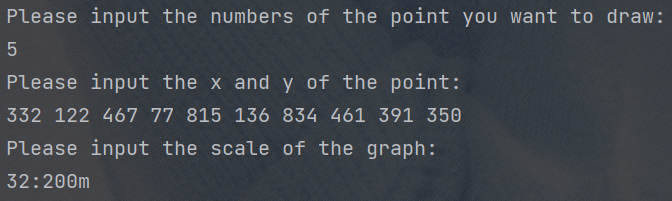
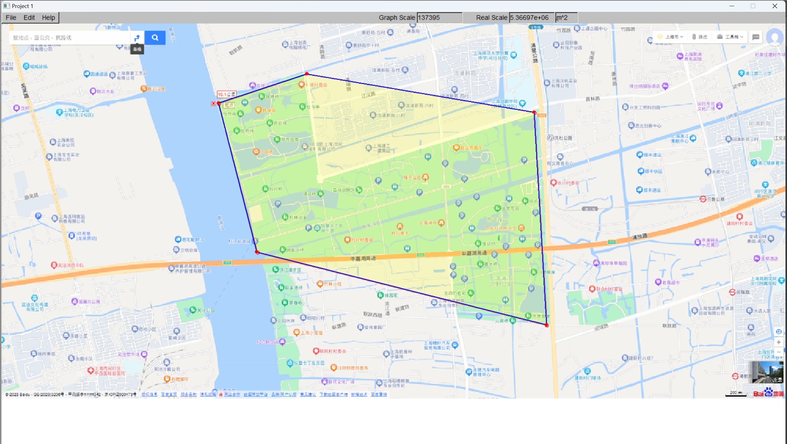

# WTQJYSJ_PROJECT1-MAP_DRAW
## 功能介绍
本部分主要就该项目的各个功能进行简单演示。
### 基础功能:导入图片
点击File/Load Image(Ctrl+d)，呼出文件选择窗口，选择所需要的地图，并且导入。
### 基础功能:键盘输入
点击Edit/Ketboard Input(Ctrl+k)，进入键盘输入模式，按提示输入顶点个数，顶点坐标，比例尺之后，即可在地图上显示高亮区域，输出像素面积与真实面积。

### 附加功能:鼠标测量比例尺
点击Edit/Measure(Ctrl+1)，呼出比例尺窗口，在real distance处输入实际距离，unit处输入单位，然后点击OK。
之后通过鼠标点击获取比例尺起始点，拖动校准，松开获取终止点，本功能写了十字校准器，使测量更加精确。
### 附加功能:鼠标选择测量区域
点击Edit/Draw(Ctrl+2)，进入绘图状态。
鼠标按顺序左键点击选择多边形区域，会有虚线跟踪鼠标，使结果更加准确，鼠标右键点击即可结束绘图。
其中已经确定的线用蓝色实现表现，正在绘制的线用红色虚线表示。
在地图，比例尺，图片均设定好之后，被选区域将会被高亮表示，像素面积与真实面积会分别自动显示在Graph Scale与Real Scale处。
### 附加功能:多次绘图
点击Edit/Clear(Ctrl+3)，即可清空当前绘制区域，然后再次开始选择，可以不用重新设置比例尺。
### 附加功能:文件保存与读取
在完成上述操作后，可以点击File/Save(Ctrl+s)，呼出文件保存窗口，输入项目名称，即可保存当前绘制区域的地图，坐标，面积。
点击File/Open(Ctrl+o)，即可呼出文件读取窗口，可以直接选择已保存的项目名称，一次性导入图片，坐标，面积等数据，瞬间完成绘图，测量。

### 优化功能:
在绘图时通过追踪鼠标，预绘制直线提高精度。同时测量比例尺时，实现了十字校准的功能，使测量更加精准。

## 运行示例
### 模式一(键盘输入)：
1.	通过File/Load Image(Ctrl+d)，选择需要的地图图片，导入地图。
   
 
3.	选择Edit/keyboard Input(Ctrl+k)，切换至键盘输入模式。
 
4.	在终端窗口输入点的个数，点坐标，比例尺，即可显示测量区域，图像面积，实际面积。
    
     
 
### 模式二(文件输入)：
1.	在上一个样例结束之后，通过File/Save(Ctrl+s)，输入名称，保存当前地图，坐标点，比例尺，面积数据。(如图2-1)

2.	通过File/Open(Ctrl+o)，可以选择本电脑已经保存的样例数据，(如图2-2)即可显示测量区域，图像面积，实际面积。(运行结果与模式一一致)
      
（图2-1）                            （图2-2）

### 模式三(鼠标输入)：
1.	通过File/Load Image(Ctrl+d)，选择需要的地图图片，导入地图。
2.	通过Edit/Measure(Ctrl+1)，设置比例尺。在图形化界面输入实际距离，（如图3-1）然后在地图上通过鼠标点击，移动，松开，设置图上距离。（如图3-2）
   
（图3-1）                              （图3-2）

3.	选择Edit/Draw Polygon(Ctrl+2)，然后通过鼠标左键画出所需要的面积，右键结束绘图，选择过程中已确定直线为蓝色实线，未确定直线为红色虚线。（如图3-3所示）即可显示测量区域，图像面积，实际面积。（运行结果如图3-4）
 
（图3-3）
 
（图3-4）

